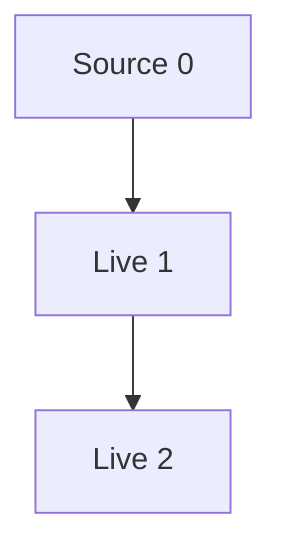

# Aurora 增量计算指南（v3.3.0）

> 语言级原生增量计算：用 `source` / `live` / `transact` 三个关键字，把纯计算块用 `live` **标记**为"活计算"——标记后自动追踪依赖，输入一变，下游按需重算，无需手写订阅与失效逻辑。
>
> 注意：不是所有函数默认就是活计算。普通 `let` 定义的函数/变量不参与增量图；只有用 `live` 关键字显式包裹的计算块，才会自动追踪依赖、按需重算。

---

## 1. 概述与动机

传统响应式代码的写法是"订阅 + 手动失效 + 手动重算"：

```text
state.on_change(rerender)
function rerender() { label.text = compute(state) }   // 样板，容易漏、容易重复算
```

随着依赖关系变长，你要自己记住"谁依赖谁"、"什么时候该刷新"、"刷新几次"。增量计算把这件事收进语言本身：

- **你声明输入**（`source`）和**计算**（`live`），引擎负责追踪依赖、决定何时重算；
- **只有真正变化、且真正被读取的计算才会执行**——惰性拉模式 + 哈希短路；
- **编译期保证纯**，运行时检测环，避免最常见的两类错误。

底层实现见 `incremental.py`：全局单例 `IncrementalEngine` 维护一张节点图，source 节点持有版本号，live 节点持有缓存结果与结构化哈希。

---

## 2. 快速上手

```aurora
# ① source：唯一的可变输入
let mut count = source(0)

# ② live：纯计算块，自动追踪它读到的节点
let doubled = live { count * 2 }
let report = live { "count=" + count + ", double=" + doubled }

println(report)        # 首次："count=0, double=0"

# ③ 修改 source
count = 5

# ④ 读取时惰性重算
println(report)        # 自动重算："count=5, double=10"
```

执行模型一句话：**写 source → 下游标记 Dirty → 读 live → 深度优先重算 → 哈希没变就短路**。

---

## 3. 三个关键字详解

### 3.1 `source(value)` —— 可变输入源

```aurora
let mut x = source(0)        # 创建一个值为 0 的源
x = 42                       # 写入：version +1，直接下游标记 Dirty
```

- `source` 是**图里唯一的输入变化点**。普通 `let` 变量是编译期绑定，写它不会触发任何重算。
- 写入语义：更新值 → 更新结构化哈希 → version 自增 → 直接下游标记 Dirty（**不递归**，不立即重算）。
- 一个 `source` 的类型记为 `Source<T>`，`T` 是初始值的类型。

### 3.1.1 `source` 与 `mut` 的语义

`source` 创建的值**内部总是可变的**——写 `source = v` 修改的是它持有的内部值，这是 `Source<T>` 节点本身的能力，**不需要** `mut` 关键字。

```aurora
let x = source(10)
x = 20                 # OK：修改 source 内部值，version+1，类型检查通过
```

`mut` 控制的是**绑定本身能否重新赋值**，与 source 内部可变性无关：

```aurora
let x = source(10)
x = source(30)         # ✗ 错误：let 绑定不可重新绑定到另一个 source

let mut y = source(10)
y = 20                 # OK：修改内部值
y = source(30)         # OK：mut 绑定允许重新绑定到一个新的 source 节点
```

- `source` 的"内部可写"是节点语义；`let`/`let mut` 控制的是名字能否重新绑定；
- 日常场景中**通常不需要 `mut`**——你只是反复写同一个 source 的内部值；
- 只有当需要把一个名字**重新绑定到不同的 source 节点**时，才需要 `let mut`。

### 3.2 `live { ... }` —— 活计算块

```aurora
let d = live { count * 2 }
```

- `live` 块必须是**纯函数**（见第 5 节）。
- 创建时状态为 `Dirty`，**第一次读取才真正计算**。
- 计算期间它读到了哪些 source/live，运行时自动记录为依赖（动态依赖追踪）。
- 类型记为 `Live<T>`，`T` 是块返回值的类型。

读取 `d` 的规则：

1. 依赖没变 → 返回缓存结果（cache hit）；
2. 依赖变了 → 深度优先重算依赖，再算自己；
3. 重算后结果哈希不变 → 短路，不通知下游；
4. 结果变了 → 更新缓存并通知订阅者。

### 3.3 `transact { ... }` —— 批量事务

```aurora
let mut a = source(0)
let mut b = source(0)

let sum = live { a + b }

transact {
    a = 1
    b = 2
}
# 块内两次写入只累积，块结束时统一标记一次
println(sum)     # 3，只重算一次
```

- 事务块内对 source 的写入**不立即传播**，只把 source 记入脏集合；
- 块结束时，所有脏 source 统一 version+1 并标记下游；
- 效果：多个输入一起变时，下游只看到一次"最终态"，避免中间态触发多次重算与 UI 抖动。
- 事务可嵌套，计数到 0 才真正提交。

---

## 4. 类型系统

| 类型 | 含义 | 可写 | 可被 live 读取 |
| --- | --- | --- | --- |
| `Source<T>` | 可变源节点，外部输入 | 是（`source = v`） | 是，读即建立依赖 |
| `Live<T>` | 活计算节点，纯计算 | 否 | 是，读即建立依赖 |

- `source(x)` 的静态类型是 `Source<typeof(x)>`。
- `live { e }` 的静态类型是 `Live<typeof(e)>`。
- 在 `live` 块内读取一个 `Source<T>` 或 `Live<T>`，得到的是其**解包后的值 `T`**（透明解包，不需要手动 `.value`）。
- `Live<T>` 可以再被别的 `live` 依赖，形成任意深度的计算图。

---

## 5. 纯度检查

### 5.1 什么是纯函数

`live` 块被要求是**纯函数**：

- 只依赖它读到的 source / live；
- 相同输入必然得到相同输出；
- **不**修改外部变量、**不**产生副作用、**不**依赖时间 / 随机数 / 网络。

### 5.2 `live` 块内的限制

类型检查器在编译期拒绝以下写法：

```aurora
let mut side_effect = 0

# ✗ 错误：live 块内对普通变量赋值（副作用）
let bad = live { side_effect = side_effect + 1; count }

# ✗ 错误：调用非纯函数（如读时钟、随机）
let also_bad = live { now() }
```

### 5.3 报错示例

```text
PurityError: live 块必须是纯函数,不允许在块内赋值 `side_effect`
  at bad.aur:4:25
```

把"会变的东西"全部放进 `source`，把"怎么算"放进 `live`，就能既享受自动重算，又保证可预测、可缓存。

---

## 6. 高级特性

### 6.1 订阅与回调（subscribe）

```aurora
let mut name = source("")
let greeting = live { "Hello, " + name }

greeting.subscribe(fn(new, old) {
    println("变化: " + old + " -> " + new)
})

name = "Aurora"     # 触发: 变化:  -> Hello, Aurora
```

- 回调签名是 `fn(new_value, old_value)`；
- **只有结果真正变化时才回调**（哈希短路保证），值没变不会重复触发；
- 常用于把 live 结果接到 UI、DOM、日志或持久化上。

### 6.2 事务（transact）

见 3.3。要点：

- 多个 source 一次性更新，下游只重算一次；
- 事务中读到的 live 仍是旧值（事务提交前不传播），符合"原子更新"直觉；
- 适合"一个动作改多个状态"的场景（登录、表单提交、批量配置切换）。

### 6.3 依赖图导出（export_graph）

```python
# 从运行时引擎导出（Python 侧 / 调试工具）
g = engine.export_graph("mermaid")   # 或 "dot"
```

Mermaid 输出形如：



- `mermaid`：直接贴进支持 Mermaid 的文档/笔记渲染；
- `dot`：可交给 Graphviz 渲染成图片；
- 用于教学、排查"为什么这个节点没刷新 / 谁依赖了它"。

### 6.4 性能统计（get_stats）

```python
stats = engine.get_stats()
# {
#   "total_nodes": 12,
#   "source_count": 3,
#   "live_count": 9,
#   "recomputes": 4,        # 实际重算次数
#   "cache_hits": 27,       # 命中缓存次数
#   "total_time": 0.0023,   # 累计计算耗时(秒)
# }
```

- `recomputes` 远小于修改次数，说明哈希短路在起作用；
- `cache_hits` 高说明惰性读取避免了重复计算。

### 6.5 哈希短路的适用条件

哈希短路（结果哈希不变就不通知下游）**不是无条件生效**，它只在"输入变了、但输出没变"时才省下计算：

```aurora
let mut x = source(0)
let flag = live { x > 10 }

x = 5        # flag = false
x = 6        # 输入变了(5→6)，但输出仍是 false → 哈希短路，下游不重算
```

- 短路的价值在于**阻断级联**：A 变化但输出不变时，依赖 A 的 B / C / D 全都不会重算；
- **单调递增场景短路率为 0%**：如 `counter = counter + 1`，每次输出都变，短路从不命中。此时增量计算相比直接计算**反而有额外开销**（依赖图维护、哈希计算），这类纯累加场景直接用普通变量更合适；
- 当前**不支持** `live(cache = False)` 之类的选项来对单个节点禁用缓存（已列为未来增强）；
- 何时值得用增量计算：输入高频变化、但输出经常"没变"（如 `x > 10`、分组过滤、阈值判断、UI 派生状态）。

### 6.6 大对象哈希与引用追踪

```aurora
let mut big = source([...一个很长的列表...])
```

- 内置值（int / float / str / bool / list / dict / tuple）做**结构化哈希**；
- 序列化后**超过约 1KB 的大对象自动降级为引用追踪**——用 `id()` 比较对象身份，不再做结构化哈希，避免每次重算都对巨大数据算哈希；
- 1KB 是当前**固定阈值**，未来可能支持 `live(hash_threshold = 4096)` 之类的选项调整；
- **引用追踪的含义**：对象身份变了才标记脏；内容变化（如 `list.append(...)`）**不会**标记依赖它的 live 为脏。

```aurora
let mut items = source([1, 2, 3])
items.value.append(4)      # ✗ 不会触发重算：只是改了内部内容，id 没变
items = [...items, 4]      # ✓ 整体重新赋值，身份/值都变，触发重算
```

建议：大对象用 `source` 包裹后，**修改时整体重新赋值**，而不是原地 `append` / 改字段。

---

## 7. 最佳实践

**什么时候用 `source`**：
- 外部输入：用户输入、网络回包、定时器、文件变更；
- 真正"会变"且下游要跟着变的状态。

**什么时候用普通变量**：
- 配置常量、一次性计算的中间值、不随输入变化的值——不要过度包装成 source。

**什么时候用 `live`**：
- 由一个或多个 source/live 纯计算出来、且会被多处读取或订阅的值。

**避免循环依赖**：
- `A 依赖 B，B 又依赖 A` 会在运行时抛出循环依赖错误；
- 数据流应该是单向的：`source → live → live → 渲染/订阅`。

**多用 `transact`**：
- 一次逻辑操作改多个 source 时，包进 `transact`，下游只看到一次最终态。

**保持 live 块小而纯**：
- 一个 live 块只做一件纯计算；副作用放在 `subscribe` 回调里。

---

## 8. 与响应式编程的对比

| 维度 | 传统响应式（如手动订阅 / 框架 watch） | Aurora 增量计算 |
| --- | --- | --- |
| 依赖追踪 | 手动声明或扫描模板 | 运行时自动记录读取 |
| 重算时机 | 通常立即推送（push） | 拉模式，读取时才算（pull） |
| 无变化的值 | 仍可能触发下游刷新 | 哈希短路，没变不通知 |
| 批量更新 | 需要手动合并或防抖动 | `transact` 语言内建 |
| 纯性保证 | 靠约定 | 编译期纯度检查 |
| 循环依赖 | 运行时栈溢出或静默死循环 | 运行时明确报错 |
| 可观测性 | 自行打点 | 内建图导出 + 统计 |

核心理念差异：响应式框架强调"数据变了就推出去"；Aurora 强调"**谁读、读了什么、结果变没变**"，只在真正需要时做最少的工作。

---

## 9. 与其他方案对比

增量计算不是新想法——前端框架、Rust 库、研究系统各有实现。Aurora 的定位是把它做进**语言本身**。下面诚实对比，不夸大。

### 9.1 vs Vue 3 响应式系统

- **Vue 的优势**：`ref` / `reactive` 生态成熟、文档完整、有成熟的 Vue DevTools，组件开发者几乎零成本上手；
- **Vue 的边界**：仅限 JS 运行时，响应式靠代理（Proxy）在运行时追踪；
- **Aurora 的差异**：可编译为原生机器码（不只是运行时解释），并且在**编译期**做纯度检查（Vue 做不到运行时之外的纯性保证）；
- 结论：做 Web 组件、追求生态选 Vue；追求编译期保证与原生性能，Aurora 更合适。

### 9.2 vs Salsa（Rust）

- **Salsa 的优势**：成熟的生产级库，支持并行计算与中间结果持久化（持久化跨会话复用）；
- **Salsa 的代价**：它是**库**，需要你手工声明 `input` / `tracked` / `#[salsa::tracked]` 等标注，样板代码较多；
- **Aurora 的差异**：`live` 块自动追踪依赖，无需手写 input/tracked 标注；并且与 Aurora 自身的类型系统深度集成（透明解包、编译期纯度检查）；
- 结论：Salsa 更成熟、有并行与持久化；Aurora 更简洁、与语言一体。

### 9.3 vs React Hooks（useMemo / useEffect）

- **React 的优势**：组件模型下极其顺手，生态与工具链庞大；
- **React 的边界**：依赖追踪限于**组件树**内，且 `useMemo` 需要你**手动声明依赖数组**，漏写/多写都容易出 bug；
- **Aurora 的差异**：支持**任意计算**（不限于组件树），依赖由引擎**自动追踪**，不需要手写依赖数组；
- 结论：UI 组件层选 React；通用、任意深度的纯计算增量，Aurora 更省心。

### 9.4 vs Adapton（研究系统）

- **Adapton 的优势**：支持**命名计算**（named thunk）与**增量数据结构**（修改一个元素只重算依赖该元素的计算）；
- **Aurora 的现状**：当前 `live` 块是**匿名**的，暂不支持命名计算，也不提供内置增量列表/映射；字段级依赖追踪已部分支持（`source.field = value` 只标记依赖该字段的 live）；
- 结论：命名计算与增量数据结构是 Aurora 的未来增强方向（见第 14 节）。

### 9.5 Aurora 的真正差异化

不吹"其他语言做不到"——其他语言的**库级方案**（Salsa / Vue / Adapton）各有成熟之处。Aurora 真正的差异化是四件事的组合：

1. **编译期纯度检查**——`live` 块的副作用在编译期报错，库级方案只能靠约定；
2. **可编译为原生机器码**——不局限于 JS/托管运行时；
3. **与语言类型系统深度集成**——`Source<T>` / `Live<T>` 透明解包，无运行时代理开销；
4. **三个关键字的极简 API**——`source` / `live` / `transact`，零手写依赖声明。

---

## 10. 调试器支持

`live` 块是惰性的，调试时需要理解它的执行时机：

- **断点在"重算时"触发，定义时不触发**：写 `let d = live { ... }` 只是建图，块内代码此时不跑；只有真正**读取** `d`（且节点 Dirty）时，断点才停；
- **被哈希短路时断点不触发**：若重算后结果与上次相同（短路），你看到的是缓存路径；更重要的是——如果依赖没变走 cache hit，块体**根本不会执行**，断点自然不停；
- **时间旅行调试暂不支持 live 块内部反向步进**：当前反向步进在 live 块内部的重算历史上行为未定义；
- **调试技巧**：排查执行流程时，临时把 `live { ... }` 换成普通 `let ... = ...`，即可按普通同步代码单步观察；确认逻辑无误后再换回 `live`；
- **`engine.export_graph()`**：导出依赖图（Mermaid / DOT），辅助看"谁依赖谁、这条链有多深"；
- **`engine.get_stats()`**：查看实际重算次数（`recomputes`）、缓存命中（`cache_hits`）与累计耗时（`total_time`），定位热点节点。

---

## 11. 性能限制

增量计算并非免费——它用依赖图维护换来了按需重算。在极端图结构下要知道开销在哪：

- **单条依赖链过深**：单条依赖链超过约 10,000 节点时，整链重算是 **O(N)** 线性下降（每改一次都要沿链重走）；
- **稠密图**：若每个节点依赖前面所有节点（如 `a1; a2=a1+1; a3=a2+1...` 的链式叠加），一次重算可能升级为 **O(N²)**；
- **建议**：把连续、简单的 live 合并成一个块，避免人为制造过深的依赖链；
- **参考量级**：Python 解释器下，1000 节点的链式重算约 **< 500ms**；
- **原生后端**：编译为原生机器码后，相同图的重算性能提升约 **10–100 倍**。

---

## 12. 控制流与静态依赖追踪

当前依赖追踪是**静态的**：在 live 创建（分析）阶段就确定它引用了哪些 source/live，**不随运行时控制流变化**。

```aurora
let result = live {
    if cond { a + 1 } else { b + 2 }
}
```

- 上面这个 live **同时依赖 `a` 和 `b`**——即使运行时 `cond` 为真只走了 `a` 分支，`b` 的变化也会标记它为 Dirty；
- 引擎在重算后按本次实际读取集合刷新依赖列表，但**分析期的静态集合**是保守上界；
- **动态依赖追踪**（只真正追踪实际执行到的分支）已列为未来增强；
- 静态追踪的优势：**可预测、编译期可分析、无运行时追踪开销**——你在代码里看到读了什么，它就依赖什么。

---

## 13. LSP 与依赖边

- 当前 LSP 的"查找引用"会把 **增量依赖引用**（live 块中读到的 source 变量）与普通代码引用**混在一起**返回；
- 未来版本会分组显示：**普通引用** vs **增量依赖引用**，方便区分"这是真的用了，还是只是被 live 读了一下"；
- `engine.export_graph()` 导出的依赖图，可作为 LSP 内依赖可视化（悬停/高亮依赖边）的数据基础。

---

## 14. 限制与未来方向

当前增量计算的已知边界：

- **live 是匿名的**：暂不支持 Adapton 风格的**命名计算**（named thunk / 命名 thunk），即无法按名字取出一个中间计算节点并单独订阅/持久化；
- **不支持增量数据结构**：暂不提供增量列表 / 增量映射——修改列表中一个元素，只会重算整体，不会只重算依赖那个元素的计算；
- **字段级依赖追踪已部分支持**：`source.field = value` 只标记依赖该字段的 live（而非整个 source 的所有下游）；
- **时间旅行反向步进、命名计算、增量数据结构、动态依赖追踪、`live(cache = False)` 关闭缓存、`live(hash_threshold = ...)` 调整哈希阈值**均列为未来增强方向。

---

## 15. 常见问题 FAQ

**Q：我改了 source ，为什么 println 没输出新值？**
A：增量计算是拉模式。写入只标记 Dirty，必须**读取**那个 live 才会重算。把读取放在写入之后即可。

**Q：为什么改了输入，UI 却没更新？**
A：检查是否用了 `subscribe` 把结果接到 UI；并且确认结果真的变了——哈希短路会让"值没变"的修改不触发回调。

**Q：live 块里能写 `if` / 循环吗？**
A：可以，只要整体是纯函数、不产生副作用。动态分支下读到了不同的依赖，引擎会在重算后自动更新依赖列表。

**Q：会出现无限重算吗？**
A：不会。重算时节点进入 `Computing` 状态，若它（直接或间接）又依赖自己，引擎立即抛循环依赖错误。

**Q：大对象（数组/字典）也做哈希吗？**
A：内置值（int/float/str/bool/list/dict/tuple）做结构化哈希；序列化超过约 1KB 的大对象自动降级为引用追踪，避免每次重算都哈希巨大数据。

**Q：transact 里读 live 看到的是新值还是旧值？**
A：旧值。事务提交前不传播，保证你看到的是一致的"事务前世界"，提交后再统一重算。

**Q：如何调试"这个节点为什么这么慢 / 算了几次"？**
A：用 `get_stats()` 看重算次数与耗时，用 `export_graph()` 看依赖结构，定位热点节点。
